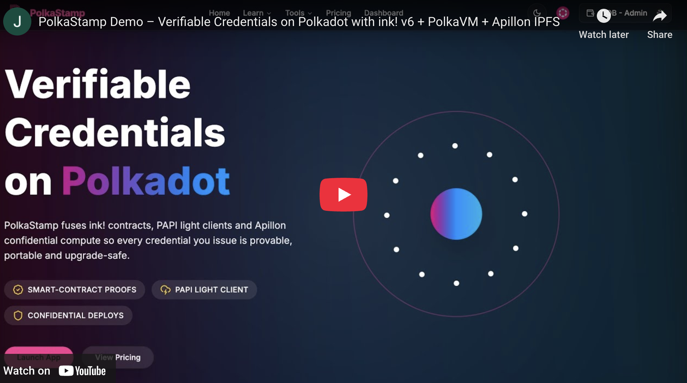
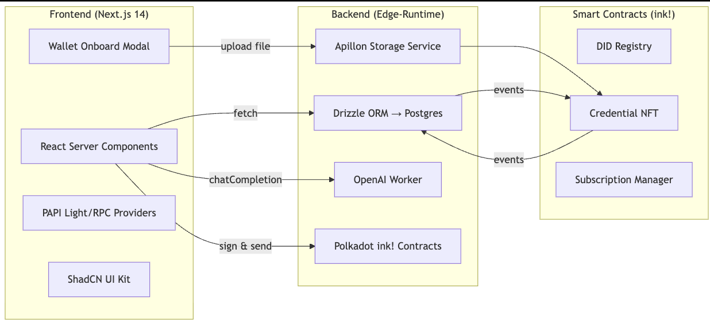

# PolkaStamp — AI-Assisted Talent Verification on Polkadot

Powered by ink! **v6** smart contracts running on **PolkaVM**, Verifiable Credentials, deterministic DIDs, and on-chain subscription billing are secured by the Polkadot relay chain.

---

## ✨ Why PolkaStamp?

- **`did:polkadot` identities** — every Team and Issuer deterministically mints a DID via `DIDRegistry::create_did`; the resulting `did:polkadot:0x…` becomes the canonical subject for all future credentials.
- **Credential NFTs** — hashed W3C Verifiable Credentials are immutably anchored as ERC-721-compatible tokens using `CredentialNFT::mint_credential`, allowing candidates and recruiters to prove provenance directly on-chain.
- **Subscription Manager** — Base / Plus plans are settled in DOT (or *any* Substrate asset via XCM) and priced in USD client-side; checkout is automatically disabled if the FX quote is older than one hour.
- **Apillon IPFS Storage** — credential files are uploaded through the Apillon SDK and returned as `ipfs://…` URIs, guaranteeing tamper-proof, content-addressed storage.
- **PAPI Light & RPC clients** — PolkaStamp ships both a Smoldot light client and a WebSocket RPC fallback (auto-selected) so every user gets instant, trust-minimised chain access without central indexers.
- **Everything in one monorepo** — Next.js 14 App Router frontend, Drizzle-powered PostgreSQL backend, GPT-4o AI workers and a fully-scripted ink! workspace live side-by-side.

---

## 🚀 Quick Start

### 1 ▪ Clone & install
~~~bash
git clone https://github.com/syntaxsurge/polkastamp.git
cd polkastamp
pnpm install
~~~

### 2 ▪ Environment
~~~bash
cp .env.example .env
~~~

| Key | Purpose |
| --- | ------- |
| `POSTGRES_URL` | Drizzle ORM connection string |
| `AUTH_SECRET` | 32-byte JWT signing secret |
| `OPENAI_API_KEY` | OpenAI key for AI workflows |
| `NEXT_PUBLIC_WS_URL` | Polkadot RPC (wss://) |
| `APILLON_*` | Credentials + bucket UUID |
| `NEXT_PUBLIC_*_CONTRACT_ADDRESS` | ink! contract addresses after deployment |

### 3 ▪ Deploy smart contracts
~~~bash
pnpm papi ink add ./blockchain/contracts/did_registry/target/ink/did_registry.json
pnpm papi ink add ./blockchain/contracts/credential_nft/target/ink/credential_nft.json
pnpm papi ink add ./blockchain/contracts/subscription_manager/target/ink/subscription_manager.json
~~~
Then follow `blockchain/README.md` to **compile → test → upload** the three contracts to your chosen parachain or local node.

### 4 ▪ Database (optional helper)
~~~bash
docker compose up -d postgres          # boots Postgres 16 on :54322
pnpm db:reset                          # runs migrations & seeds demo data
~~~

### 5 ▪ Run
~~~bash
pnpm dev
~~~
Open **http://localhost:3000** and connect any Polkadot wallet (extension, mobile QR signer or Smoldot light client).

---

## 🖥 User-Journey Snapshot

| Role | Highlights |
| ---- | ---------- |
| **Candidate** | Wallet-first onboarding → mandatory DID mint → upload credentials → AI strict-graded skill quizzes → passing score triggers on-chain anchor |
| **Issuer** | Self-service onboarding → admin approval → approve/reject verification requests → approval signs & mints Credential NFT |
| **Recruiter** | Full-text talent search (verified-only toggle) → kanban pipelines → cached AI "Why Hire” summaries |
| **Admin** | Issuer approvals, role upgrades, credential revocation, platform DID rotation, plan price updates |

---

## 🧩 Architectural Overview

---

## 🔐 Smart-Contract Suite

| Contract | Lang | Key Calls | Purpose |
| -------- | ---- | --------- | ------- |
| **DID Registry** | ink! 6 | `create_did`, `set_document`, `get_did_owners` | Deterministic SHA-256 DIDs & DID Doc hashes for Teams & Issuers |
| **Credential NFT** | ink! 6 | `mint_credential`, `update_credential`, `revoke_credential` | ERC-721-compatible NFT for hashed Verifiable Credentials |
| **Subscription Manager** | ink! 6 | `subscribe`, `update_price`, `cancel` | DOT-denominated recurring plans with on-chain receipts |

All contracts live in `/blockchain/contracts/**` with Cargo workspace tests and automatically exported descriptors for PAPI.

---

## 🤖 AI Workflows

| Feature | Entry Point | Model | Guard-Rails & Caching |
| ------- | ---------- | ----- | --------------------- |
| **Strict Quiz Grader** | `lib/ai/openai.ts → openAIAssess()` | GPT-4o | Expects *integer 0-100*, auto-retries ×3, validated via Zod |
| **Candidate Bio** | `lib/ai/openai.ts → summariseCandidateProfile()` | GPT-4o | 120-word third-person summary, SHA-256 hash prevents dups |
| **Why Hire Fit JSON** | `lib/ai/openai.ts → generateCandidateFitSummary()` | GPT-4o | 5 × 12-word bullets, schema-validated JSON, cached per recruiter |

Exact prompts are documented in **`README > AI Prompt & Usage Summary`**.

---

## 🛠 Dev Scripts

| Command | Action |
| ------- | ------ |
| `pnpm db:generate` | Generate Drizzle migrations |
| `pnpm db:migrate`  | Apply migrations |
| `pnpm contracts:deploy` | Compile & upload all ink! contracts (see `scripts/deploy-contracts.ts`) |
| `pnpm contracts:copy-abis` | Regenerate PAPI descriptors after deployment |

---

## 🐳 Docker

The included `docker-compose.yml` starts a Postgres 16 service on **localhost:54322**:
~~~yaml
services:
  postgres:
    image: postgres:16-alpine
    environment:
      POSTGRES_DB: polkastamp_postgres
      POSTGRES_USER: postgres
      POSTGRES_PASSWORD: postgres
    ports:
      - '54322:5432'
~~~

---

## 🛡 Security Notes

* All JWT cookies are **HTTP-only + SameSite=Lax** and auto-refreshed every 24 h (sliding window).
* Uploads are capped at **25 MiB** and MIME-white-listed (`application/pdf`, `image/*`).
* Role-based route guards live in `lib/auth/guards.ts` and are mirrored in `middleware.ts` for edge enforcement.

---

## 📚 Further Reading

* **PAPI** — <https://docs.polkadot.com/develop/toolkit/api-libraries/papi/>
* **Apillon Storage** — <https://apillon.io/docs>
* **ink! & PolkaVM** — <https://paritytech.github.io/ink/>
* **GPT-4o** — <https://platform.openai.com/docs/models/gpt-4o>

---

## 🙋 Need Help?

Open an issue or start a discussion—feedback & PRs are welcome!